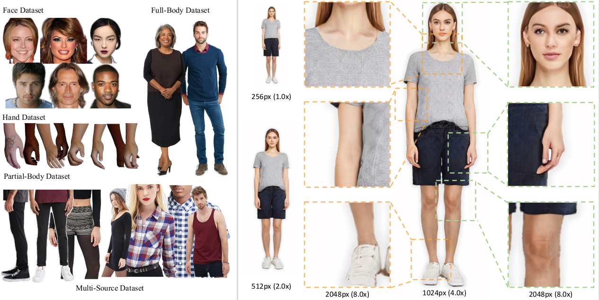

# UnitedHuman: Harnessing Multi-Source Data for High-Resolution Human Generation


[Jianglin Fu](https://github.com/arleneF), [Shikai Li](mailto:lishikai@pjlab.org.cn), [Yuming Jiang](https://yumingj.github.io/), [Kwan-Yee Lin](https://kwanyeelin.github.io/), [Wayne Wu](https://wywu.github.io/), and [Ziwei Liu](https://liuziwei7.github.io/) <br>
**[[Video Demo]](https://www.youtube.com/watch?v=pdsfUYFDLSw)** | **[[Project Page]](https://unitedhuman.github.io/)** | **[[Paper]](https://arxiv.org/abs/2309.14335)**

**Abstract:** *Human generation has achieved significant progress. Nonetheless, existing methods still struggle to synthesize specific regions such as faces and hands. We argue that the main reason is rooted in the training data. A holistic human dataset inevitably has insufficient and low-resolution information on local parts. Therefore, we propose to use multi-source datasets with various resolution images to jointly learn a high-resolution human generative model. 
However, multi-source data inherently a) contains different parts that do not spatially align into a coherent human, and b) comes with different scales. 
To tackle these challenges, we propose an end-to-end framework, UnitedHuman, that empowers continuous GAN with the ability to effectively utilize multi-source data for high-resolution human generation. Specifically, 1) we design a Multi-Source Spatial Transformer that spatially aligns multi-source images to full-body space with a human parametric model. 2) Next, a continuous GAN is proposed with global-structural guidance and CutMix consistency. Patches from different datasets are then sampled and transformed to supervise the training of this scale-invariant generative model. Extensive experiments demonstrate that our model jointly learned from multi-source data achieves superior quality than those learned from a holistic dataset.* <br>

## Updates
- [01/01/2024] Pretrained model and inference scripts are released.
- [26/09/2023] Our paper is released on arXiv.
- [13/07/2023] Our work has been accepted by ICCV2023!


## TODOs
- [x] Release technical report.
- [x] Release Inference code.
- [x] Release pretrained models.
- [ ] Release training code.


## Usage

### Installation
To work with this project on your own machine, you need to install the environmnet as follows: 

```
conda env create -f environment.yml
conda activate unitedhuman
```

### Pretrained models
Please put the downloaded [pretrained models](https://drive.google.com/file/d/1sgtMRWZJ1v4rVzQUaMNeZ8oGv01CyHqm/view?usp=sharing) under the folder 'models'.

### Inference
This script generates samples with [target_size], you can set it to 256, 512, 1024, 2048.
if [only_mean] is set to true, you will get image generate by mean latent.
```
python inference.py --path_list models/network-snapshot-v1.pkl --only_mean --target_size 2048
```


## Related Work
* (ECCV 2022) **StyleGAN-Human: A Data-Centric Odyssey of Human Generation**, Jianglin Fu et al. [[Paper](https://arxiv.org/pdf/2204.11823.pdf)], [[Project Page](https://stylegan-human.github.io/)], [[Dataset](https://github.com/stylegan-human/StyleGAN-Human)]

## Citation

If you find this work useful for your research, please consider citing our paper:

```bibtex
@article{fu2023unitedhuman,
    title={UnitedHuman: Harnessing Multi-Source Data for High-Resolution Human Generation}, 
    author={Fu, Jianglin and Li, Shikai and Jiang, Yuming and Lin, Kwan-Yee and Wu, Wayne and Liu, Ziwei},
    journal   = {arXiv preprint},
    volume    = {arXiv:2309.14335},
    year    = {2023}
}
```

